# Figura 1 — Arquitectura General del Sistema por Capas

> **Descripción:** Diagrama de arquitectura en bloques que muestra todas las capas del sistema
> PocketMentorEDU, desde la interfaz de usuario hasta el almacenamiento de datos. Cada capa está
> desglosada en sus componentes técnicos reales.

```mermaid
%%{init: {
  "theme": "base",
  "themeVariables": {
    "primaryColor":        "#1e2a3a",
    "primaryTextColor":    "#e8eaf0",
    "primaryBorderColor":  "#3d5a80",
    "lineColor":           "#6b8cba",
    "secondaryColor":      "#0d1b2a",
    "tertiaryColor":       "#162032",
    "background":          "#0d1b2a",
    "mainBkg":             "#1e2a3a",
    "nodeBorder":          "#3d5a80",
    "clusterBkg":          "#12203a",
    "clusterBorder":       "#4a7fa5",
    "edgeLabelBackground": "#1e2a3a",
    "fontFamily":          "Georgia, serif",
    "fontSize":            "14px"
  }
}}%%

flowchart TB

  %% =====================================================================
  %% CAPA 0 — PUNTO DE ENTRADA (Launcher)
  %% =====================================================================
  subgraph L0["⓪  CAPA DE ENTRADA  ·  Launcher & Arranque"]
    direction LR
    BAT["INICIAR.bat\n─────────────\n• Valida Python portable\n• Configura HF_HUB_OFFLINE=1\n• Configura SENTENCE_TRANSFORMERS_HOME\n• Instala VC++ Redistributable (si falta)\n• Abre http://localhost:8000"]
    MAIN["main.py\n─────────────\n• Parseo de argumentos CLI\n• Configura env offline\n• Orquesta ciclo de vida completo\n• Maneja señales SIGINT / SIGTERM\n• Cierre limpio → cifrado + métricas"]
    BAT -->|"exec"| MAIN
  end

  %% =====================================================================
  %% CAPA 1 — HARDWARE & RUNTIME
  %% =====================================================================
  subgraph L1["①  CAPA DE HARDWARE  ·  Detección & Runtime"]
    direction LR
    HW["detect_hardware()\n─────────────\n• CPU threads via psutil\n• RAM total via psutil\n• GPU CUDA via nvidia-smi\n• n_ctx dinámico según RAM"]
    RUNTIME["WinPython 3.11\n─────────────\n• Python portable (~1.5 GB)\n• Todas las dependencias\n• Sin instalación requerida"]
    HW -.->|"configura"| RUNTIME
  end

  %% =====================================================================
  %% CAPA 2 — SEGURIDAD
  %% =====================================================================
  subgraph L2["②  CAPA DE SEGURIDAD  ·  Cifrado AES-256"]
    direction LR
    CRYPTO["CryptoManager  ·  crypto.py\n─────────────────────────\n• PBKDF2-HMAC-SHA256  (600K iter.)\n• AES-256-GCM  con nonces aleatorios\n• Cifra knowledge/ + database/ en reposo\n• Descifra al arranque si hay archivos .enc"]
  end

  %% =====================================================================
  %% CAPA 3 — INGESTA DE CONOCIMIENTO
  %% =====================================================================
  subgraph L3["③  CAPA DE INGESTA  ·  Document Processing Pipeline"]
    direction LR
    DOCS["knowledge/\n─────────────\n• PDF  (PyMuPDF)\n• TXT  (utf-8)\n• MD   (utf-8)\n• DOCX (python-docx)"]
    ING["Ingester  ·  ingester.py\n─────────────────────────\n• Hash MD5 → detección de cambios\n• Rutas relativas (portabilidad USB)\n• Parent chunks: 1 024 tokens\n• Child  chunks:   128 tokens\n• Overlap: 32 tokens"]
    EMB_ING["SentenceTransformer\nparaphrase-multilingual-MiniLM-L12-v2\n─────────────────────────────────────\n• 384 dimensiones\n• Multilingüe (es / en)\n• Compartido con RAGEngine"]
    INDEX["database/\n─────────────\n• chunks.json   (child)\n• parents.json  (parent)\n• embeddings.npy (float32)\n• file_hashes.json\n• staging/*.json"]
    DOCS -->|"extrae texto\npor página"| ING
    ING  -->|"encode() batch 64"| EMB_ING
    EMB_ING -->|"np.save()"| INDEX
  end

  %% =====================================================================
  %% CAPA 4 — MOTOR RAG
  %% =====================================================================
  subgraph L4["④  MOTOR RAG HÍBRIDO  ·  Retrieval-Augmented Generation"]
    direction TB
    subgraph RAG_RET["Recuperación de Información"]
      direction LR
      QE["Query Expansion\n─────────────────\n• Query original (es)\n• Query sin puntuación\n• Traducción ES→EN\n  (vía diccionario _MATH_TERMS)\n• Hasta 4 variantes"]
      VS["Búsqueda Vectorial\n─────────────────\n• Coseno contra embeddings.npy\n• top-30 por variante\n• Complejidad O(n)"]
      BM["Búsqueda BM25\n─────────────────\n• BM25Okapi (rank-bm25)\n• Tokenización lowercase\n• top-30 por variante"]
      RRF["Reciprocal Rank Fusion\n─────────────────────────\n• RRF(k=60) sobre cada lista\n• Combinación ponderada:\n  60 % vector + 40 % BM25\n• Selecciona top-2k candidatos"]
      QE --> VS
      QE --> BM
      VS --> RRF
      BM --> RRF
    end
    subgraph RAG_RANK["Re-Ranking & Contexto"]
      direction LR
      PDR["Parent-Document Retrieval\n───────────────────────────\n• child_id → parent_id lookup\n• Retorna texto completo (1024t)\n• Elimina duplicados de padres"]
      RERANK["CrossEncoder Re-Ranking\n────────────────────────\n• cross-encoder/ms-marco-MiniLM-L-6-v2\n• predict([(query, text[:768])])\n• Reordena candidatos por relevancia"]
      CTX["build_context()\n─────────────────\n• Formatea fuentes + páginas\n• Límite ~2048 tokens de contexto\n• Prepara bloque para el prompt"]
      PDR --> RERANK
      RERANK --> CTX
    end
    RRF --> PDR
  end

  %% =====================================================================
  %% CAPA 5 — LLM & PROMPTS
  %% =====================================================================
  subgraph L5["⑤  CAPA LLM & PROMPTS PEDAGÓGICOS"]
    direction TB
    subgraph LLM_MDL["Modelo de Lenguaje"]
      direction LR
      GGUF["Modelos GGUF (llama-cpp-python)\n──────────────────────────────\n• Phi-4-mini-instruct-Q4_K_M (2.49 GB)\n• Qwen2.5-3B-Instruct-Q4_K_M (2.10 GB)\n• n_ctx dinámico: 2048/4096/8192\n• GPU offloading: hasta 35 capas\n• Hot-reload vía AppState.reload_llm()"]
    end
    subgraph PROMPT["Constructor de Prompts ESL"]
      direction LR
      SUBJ["Área ESL\n──────────\ngeneral_english\ngrammar\nvocabulary\npronunciation\nreading · writing\nspeaking"]
      LEVEL["Nivel CEFR\n──────────\nbasic (A1–A2)\nintermediate (B1)\nadvanced (B2)"]
      MODE["Modo Pedagógico\n──────────────\nnormal\nsocrático\nquiz\nvisual"]
      PB["build_full_prompt()\n────────────────────\n1. System Prompt\n2. Perfil del estudiante\n3. Historial de sesión\n4. Contexto RAG\n5. Pregunta del estudiante\n→ 'Tutor:'"]
      SUBJ --> PB
      LEVEL --> PB
      MODE --> PB
    end
    PB -->|"prompt completo"| GGUF
  end

  %% =====================================================================
  %% CAPA 6 — MEMORIA & EVALUACIÓN
  %% =====================================================================
  subgraph L6["⑥  CAPA DE MEMORIA E INDICADORES AUTOMÁTICOS"]
    direction LR
    subgraph MEM["SessionMemory  ·  memory.py"]
      direction TB
      WIN["Ventana deslizante\n5 turnos activos\n(user + assistant)"]
      COMP["Compresión LLM\n(si historial > 10 msg)\nResumen en máx. 3 líneas"]
      PROF["Perfil del Estudiante\n──────────────────────\n• Nivel CEFR (auto-detectado)\n• Área de estudio\n• Temas visitados (últimos 20)\n• Total de turnos\n• Persistido en sessions/*.json"]
      WIN --> COMP
    end
    subgraph EVAL["ResponseEvaluator  ·  evaluator.py"]
      direction TB
      FAST["Modo FAST\n──────────\nJaccard tokens\n(~0 ms)"]
      FULL["Modo FULL\n──────────\nCoseno embeddings\n(~200–500 ms)"]
      SCORE["Puntuación Compuesta\n──────────────────────\n• Grounding  40 %\n• Relevance  40 %\n• Level coherence 20 %\nUmbral: 0.60"]
      FAST --> SCORE
      FULL --> SCORE
    end
  end

  %% =====================================================================
  %% CAPA 7 — API & SERVIDOR
  %% =====================================================================
  subgraph L7["⑦  CAPA API  ·  FastAPI + Uvicorn"]
    direction LR
    API["api.py  (FastAPI v2.0)\n──────────────────────\nGET  /                    → chat.html\nGET  /dashboard           → dashboard.html\nGET  /settings            → settings.html\nGET  /knowledge           → knowledge.html\nGET  /theme               → theme.html\nPOST /api/chat            → SSE streaming\nPOST /api/upload          → ingesta en caliente\nPOST /api/hardware/reload → hot-reload LLM\nGET  /api/system/stats    → RAM + modelo\nGET  /api/history         → sesiones\nGET  /api/settings        → configuración\n/static                   → frontend/"]
    UVI["Uvicorn ASGI\n────────────\nhost 127.0.0.1\nport 8000\nasync SSE generator"]
    API --> UVI
  end

  %% =====================================================================
  %% CAPA 8 — FRONTEND
  %% =====================================================================
  subgraph L8["⑧  CAPA DE PRESENTACIÓN  ·  Frontend HTML/CSS/JS"]
    direction LR
    subgraph FE_PAGES["Páginas"]
      direction TB
      CH["chat.html\n─────────\nConversación SSE\nStreaming token a token"]
      DA["dashboard.html\n───────────────\nMétricas de sesión\nHistorial de turnos"]
      SE["settings.html\n──────────────\nParámetros LLM\nConfig. hardware\nGlosario (tooltips)"]
      KN["knowledge.html\n───────────────\nDrag-and-drop upload\nEstado del índice vectorial"]
      TH["theme.html\n────────────\n8 paletas de color\nPersistencia localStorage"]
    end
    subgraph FE_TECH["Tecnología Frontend"]
      direction TB
      JS["app.js  ·  settings.js\n──────────────────────\n• EventSource (SSE nativo)\n• localStorage (settings)\n• Fetch API\n• Anti-FOUC (pre-render HTML)\n• Cache-busting ?v=2.1"]
      CSS["style.css\n──────────\n• Diseño Neumórfico\n• Sin frameworks externos\n• Sin Google Fonts (offline)\n• Iconos SVG nativos\n• CSS variables (temas)"]
    end
  end

  %% =====================================================================
  %% ALMACENAMIENTO PERSISTENTE
  %% =====================================================================
  subgraph STORE["ALMACENAMIENTO LOCAL  ·  100 % Offline"]
    direction LR
    S1["models/\n──────────\n.gguf (LLM)\n.cache/ (embedders)"]
    S2["database/\n──────────\nchunks.json\nparents.json\nembeddings.npy\nsettings.json"]
    S3["sessions/\n──────────\nuser_ts.json\nuser_profile.json"]
    S4["logs/\n──────────\nsystem.log\nsession_*.json"]
    S5["knowledge/\n──────────\nPDF · TXT\nMD  · DOCX\n*.enc (cifrado)"]
  end

  %% =====================================================================
  %% FLUJO PRINCIPAL entre capas
  %% =====================================================================
  MAIN    -->|"1 detect"| HW
  MAIN    -->|"2 unlock"| CRYPTO
  MAIN    -->|"3 init"| L3
  MAIN    -->|"4 load"| L4
  MAIN    -->|"5 load"| L5
  MAIN    -->|"6 init"| L6
  MAIN    -->|"7 serve"| L7
  L7      -->|"sirve"| L8
  CTX     -->|"contexto"| PB
  GGUF    -->|"tokens SSE"| API
  SCORE   -->|"métricas SSE"| API
  PROF    -->|"perfil"| PB
  L4      -.->|"shared embedder"| EMB_ING
  L6      -.->|"shared embedder"| EMB_ING

  %% =====================================================================
  %% Estilos
  %% =====================================================================
  classDef layerTitle fill:#0d1b2a,stroke:#4a7fa5,color:#a0c4e4,font-weight:bold
  classDef component  fill:#1a2d45,stroke:#3d6b94,color:#d0e8f5,rx:6
  classDef storage    fill:#0f2233,stroke:#2e5f85,color:#8ab4d4,rx:4
  classDef critical   fill:#2a1a1a,stroke:#8b3a3a,color:#f0b0b0,rx:6

  class BAT,MAIN component
  class CRYPTO critical
  class S1,S2,S3,S4,S5 storage
```

## Descripción de Capas

| # | Capa | Módulo principal | Responsabilidad |
|---|------|-----------------|-----------------|
| ⓪ | Launcher | `INICIAR.bat` + `main.py` | Inicialización, variables de entorno offline, orquestación |
| ① | Hardware | `detect_hardware()` | Detección CPU/GPU/RAM, ajuste dinámico de n_ctx |
| ② | Seguridad | `crypto.py` | Cifrado AES-256-GCM de datos en reposo |
| ③ | Ingesta | `ingester.py` | Extracción, chunking y embedding de documentos |
| ④ | Motor RAG | `rag.py` | Recuperación híbrida + re-ranking de contexto |
| ⑤ | LLM + Prompts | `prompt_builder.py` | Construcción del prompt y generación de respuesta |
| ⑥ | Memoria/Indicadores | `memory.py` + `evaluator.py` | Historial de sesión + indicadores automáticos de respuesta |
| ⑦ | API | `api.py` + Uvicorn | Servidor REST + SSE streaming |
| ⑧ | Frontend | `frontend/*.html/js/css` | Interfaz neumórfica offline |
