# Figura 2 — Pipeline RAG Híbrido Completo por Mensaje

> **Descripción:** Diagrama de flujo que muestra el recorrido exacto de cada consulta del
> estudiante a través del motor RAG: desde la expansión de la consulta hasta la entrega
> del token de respuesta final al navegador vía Server-Sent Events.

```mermaid
%%{init: {
  "theme": "base",
  "themeVariables": {
    "primaryColor":        "#162032",
    "primaryTextColor":    "#dce8f5",
    "primaryBorderColor":  "#3d6b94",
    "lineColor":           "#5b8db8",
    "secondaryColor":      "#0d1b2a",
    "tertiaryColor":       "#1a2d40",
    "background":          "#0d1b2a",
    "mainBkg":             "#162032",
    "clusterBkg":          "#0e1e30",
    "clusterBorder":       "#3d6b94",
    "edgeLabelBackground": "#162032",
    "fontFamily":          "Georgia, serif",
    "fontSize":            "13px"
  }
}}%%

flowchart TD

  %% ── ENTRADA ──────────────────────────────────────────────────────────
  START(["🎓  Pregunta del estudiante\nvía POST /api/chat\n─────────────────────\nmessage, subject, level, mode\nuser_id, temperature, top_p\nmax_tokens, top_k_rag, eval_mode"])

  %% ── FASE 1: MEMORIA ───────────────────────────────────────────────────
  subgraph F1["FASE 1 — MEMORIA DE SESIÓN  ·  memory.py · SessionMemory"]
    direction TB
    MEM1["add_turn('user', msg, llm)\n───────────────────────────\n• Appende al historial en RAM\n• Incrementa _turn_count\n• Detecta nivel CEFR\n  (keyword matching:\n   'subjunctive' → advanced\n   'what does' → basic)"]
    MEM2{"¿Historial > 10 msgs?"}
    MEM3["_compress(llm)\n────────────────────\n• Toma los msgs más viejos\n• LLM genera resumen ≤ 80 tokens\n• Reemplaza historial antiguo\n  por bloque _summary"]
    MEM4["add_topic(subject)\n──────────────────\nRegistra área temática\n(últimos 20 distintos)"]
    MEM1 --> MEM2
    MEM2 -->|"Sí"| MEM3
    MEM2 -->|"No"| MEM4
    MEM3 --> MEM4
  end

  %% ── FASE 2: QUERY EXPANSION ───────────────────────────────────────────
  subgraph F2["FASE 2 — EXPANSIÓN DE CONSULTA  ·  rag.py · expand_query()"]
    direction TB
    QE1["Variante 1: query original\nVariante 2: query sin '?' ni '¿'"]
    QE2{"¿LLM disponible\n para traducción?"}
    QE3["Traducción LLM\n────────────────────────\nprompt: 'Translate to English,\ngive 1 alternative phrasing'\nmax_tokens=60, temp=0.1\n→ 2 variantes en inglés"]
    QE4["Traducción por diccionario\n────────────────────────\n_spanish_to_english_terms()\n(45 términos matemáticos ES→EN)"]
    QE5["Lista de hasta 4 variantes\n────────────────────────\n[query_es, query_es_clean,\n query_en_1, query_en_2]"]
    QE1 --> QE2
    QE2 -->|"Sí"| QE3
    QE2 -->|"No"| QE4
    QE3 --> QE5
    QE4 --> QE5
  end

  %% ── FASE 3: BÚSQUEDA HÍBRIDA ──────────────────────────────────────────
  subgraph F3["FASE 3 — BÚSQUEDA HÍBRIDA  ·  rag.py · hybrid_search()"]
    direction TB

    subgraph VS["Búsqueda Vectorial por variante"]
      V1["Embeder query\nvía SentenceTransformer\n encode([query_i])"]
      V2["Similitud coseno\n contra embeddings.npy\n(339 vectores × 384-dim)\nO(n) — lineal"]
      V3["Ranking top-30\npor score coseno"]
      V1 --> V2 --> V3
    end

    subgraph BM["Búsqueda BM25 por variante"]
      B1["Tokenización\nquery.lower().split()"]
      B2["BM25Okapi.get_scores()\n(rank-bm25 library)\nover child chunks corpus"]
      B3["Ranking top-30\npor score BM25"]
      B1 --> B2 --> B3
    end

    subgraph RRF_BOX["Reciprocal Rank Fusion"]
      R1["RRF vectorial:\nΣ 1/(k+rank+1)\ncon k=60\npor cada variante"]
      R2["RRF BM25:\nΣ 1/(k+rank+1)\ncon k=60\npor cada variante"]
      R3["Fusión ponderada:\nscore = 0.6 × vec_rrf\n      + 0.4 × bm25_rrf\nSelecciona top-2k IDs"]
      R1 --> R3
      R2 --> R3
    end

    VS --> R1
    BM --> R2
  end

  %% ── FASE 4: PARENT-DOCUMENT RETRIEVAL ───────────────────────────────
  subgraph F4["FASE 4 — PARENT-DOCUMENT RETRIEVAL  ·  rag.py"]
    direction TB
    PDR1["Para cada child_id en top-2k:\n────────────────────────────\nchunk = chunks donde id==child_id\npid = chunk['parent_id']"]
    PDR2{"pid ya visto?"}
    PDR3["Recuperar de parents.json:\nparent = parents[pid]\n──────────────────────────\n• Texto completo (~1024 tokens)\n• source (nombre archivo)\n• page (número de página)\n• rerank_score (placeholder)"]
    PDR4["Lista de candidatos únicos\n(máx. 2×top_k padres distintos)"]
    PDR1 --> PDR2
    PDR2 -->|"No → agregar"| PDR3
    PDR2 -->|"Sí → skip"| PDR1
    PDR3 --> PDR4
  end

  %% ── FASE 5: RE-RANKING ───────────────────────────────────────────────
  subgraph F5["FASE 5 — RE-RANKING CON CROSSENCODER  ·  rag.py"]
    direction TB
    RK1["Construir pares:\n[(query, doc_text[:768])\n  para cada candidato]"]
    RK2["CrossEncoder.predict(pairs)\n────────────────────────────\nModelo: ms-marco-MiniLM-L-6-v2\nScore de relevancia por par"]
    RK3["Ordenar candidatos por\nrerank_score DESC\nRetornar top_k (default 5)"]
    RK1 --> RK2 --> RK3
  end

  %% ── FASE 6: CONSTRUCCIÓN DEL PROMPT ─────────────────────────────────
  subgraph F6["FASE 6 — CONSTRUCCIÓN DEL PROMPT  ·  prompt_builder.py"]
    direction TB
    PB1["build_system_prompt()\n───────────────────────────\nSubject cfg: área + estilo +\n  técnica + pregunta de verificación\nLevel cfg: instrucciones CEFR\nMode cfg: variante pedagógica\n  (normal / socrático / quiz / visual)"]
    PB2["build_context(results)\n────────────────────────\n• Formatea chunks con fuente+página\n• Límite 2048 tokens total\n• '[Fuente: doc.pdf, pág. N]\\n...'"]
    PB3["build_full_prompt()\n───────────────────────────\n[System Prompt]\n[Perfil del estudiante CEFR]\n[Historial de sesión / resumen]\n[Documentos relevantes RAG]\n[Pregunta del estudiante]\nTutor:"]
    PB1 --> PB3
    PB2 --> PB3
  end

  %% ── FASE 7: INFERENCIA LLM ───────────────────────────────────────────
  subgraph F7["FASE 7 — INFERENCIA LLM  ·  llama-cpp-python · AppState"]
    direction TB
    LLM1["llm(prompt,\n────────────────────────────\n  max_tokens = req.max_tokens\n  temperature = req.temperature\n  top_p = req.top_p\n  repeat_penalty = req.repeat_penalty\n  echo = False\n  stream = True\n  stop = ['Estudiante:','━━━','Human:'])"]
    LLM2["Generación token a token\n(streaming)"]
    SSE1["SSE: {type: 'context',\n       count: N,\n       sources: [...]}"]
    SSE2["SSE: {type: 'token',\n       text: '...'}  × N tokens"]
    LLM1 -->|"stream=True"| LLM2
    LLM2 -->|"await asyncio.sleep(0.01)"| SSE2
  end

  %% ── FASE 8: EVALUACIÓN ───────────────────────────────────────────────
  subgraph F8["FASE 8 — INDICADORES AUTOMÁTICOS  ·  evaluator.py"]
    direction TB
    EV1{"eval_mode?"}
    EV2["Modo FAST\n─────────────────────\nJaccard(query, ctx)\nJaccard(response, ctx)\nVelocidad: ~0 ms"]
    EV3["Modo FULL\n──────────────────────\nCoseno vía embedder\n  compartido RAG\nVelocidad: ~200-500 ms"]
    EV4["Puntuación compuesta\n─────────────────────\nGrounding  × 0.40\nRelevance  × 0.40\nLevel coh. × 0.20\nUmbral: 0.60 → PASS"]
    EV5["SSE: {type: 'metrics',\n  data: {overall_score,\n         grounding_score,\n         relevance_score,\n         level_score, pass},\n  rag_time, gen_time}"]
    EV1 -->|"fast"| EV2
    EV1 -->|"full"| EV3
    EV1 -->|"off"| EV4
    EV2 --> EV4
    EV3 --> EV4
    EV4 --> EV5
  end

  %% ── FASE 9: PERSISTENCIA ─────────────────────────────────────────────
  subgraph F9["FASE 9 — PERSISTENCIA DE SESIÓN  ·  api.py"]
    direction TB
    PS1["memory.add_turn('assistant', response_text)\nActualizar historial en RAM"]
    PS2["Guardar / actualizar\nsessions/{user_id}_{ts}.json\n──────────────────────────\n• file_id\n• user_id, subject, level\n• start_time\n• turns: [{user_msg, agent_response}]\n• turns_count"]
    PS3["SSE: {type: 'done'}"]
    PS1 --> PS2 --> PS3
  end

  %% ── SALIDA ──────────────────────────────────────────────────────────
  END(["📱  Navegador / Frontend\nchat.html + app.js\n──────────────────────\nEventSource consume SSE:\n1. 'context' → muestra fuentes\n2. 'token'   → efecto máquina de escribir\n3. 'metrics' → tarjeta de puntuación\n4. 'done'    → finaliza spinner"])

  %% ── FLUJO GLOBAL ────────────────────────────────────────────────────
  START --> F1
  F1    --> F2
  F2    --> F3
  F3    --> F4
  F4    --> F5
  F5    --> F6
  F6    --> F7
  F7    --> SSE1 --> END
  F7    --> F8
  F8    --> F9
  F9    --> END

  %% ── ESTILOS ──────────────────────────────────────────────────────────
  classDef startEnd  fill:#1a3a5c,stroke:#5b9bd5,color:#ddeeff,rx:20,font-weight:bold
  classDef decision  fill:#2a2a12,stroke:#b5a020,color:#ffe88a
  classDef sse       fill:#0f2a20,stroke:#2ea86a,color:#88f0b8
  classDef phase     fill:#0e1e30,stroke:#3d6b94,color:#a0c4e4

  class START,END startEnd
  class MEM2,QE2,PDR2,EV1 decision
  class SSE1,SSE2,EV5,PS3 sse
```

## Métricas del Pipeline

| Fase | Complejidad | Tiempo típico (339 chunks) |
|------|------------|---------------------------|
| Query Expansion (dict) | O(1) | < 1 ms |
| Búsqueda Vectorial | O(n·d) con n=339, d=384 | ~5–15 ms |
| Búsqueda BM25 | O(n·q) | ~2–8 ms |
| RRF Fusion | O(n log n) | < 1 ms |
| Parent-Doc Retrieval | O(top_k) | < 1 ms |
| CrossEncoder Re-ranking | O(top_k) | ~50–150 ms |
| Prompt build | O(1) | < 1 ms |
| LLM Inference | — | **2–60 s** (CPU) / **3–8 s** (GPU) |
| Evaluación FAST | O(n) tokens | < 1 ms |
| Evaluación FULL | O(top_k) | ~200–500 ms |
