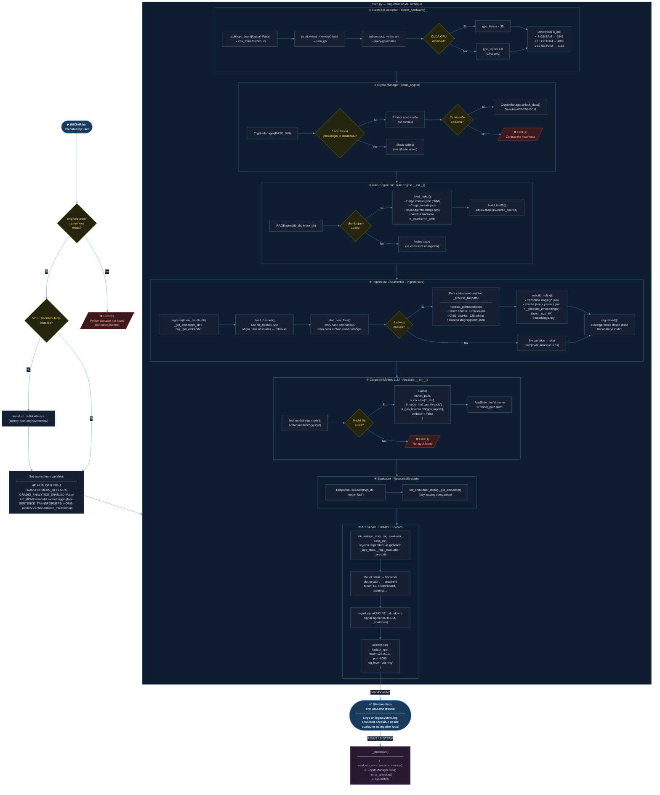

# Figura 3 — Ciclo de Inicialización del Sistema

> **Descripción:** Diagrama de flujo que representa el proceso completo de arranque de
> PocketMentorEDU, desde la ejecución del launcher `INICIAR.bat` hasta que el servidor
> está disponible en `http://localhost:8000`. Incluye todas las comprobaciones, decisiones
> y pasos de configuración de cada componente.

## Tiempos de Arranque Estimados

| Paso | Sin cambios | Con 1 PDF nuevo (339 chunks) |
|------|-------------|-------------------------------|
| Hardware detection | ~100 ms | ~100 ms |
| Crypto (sin cifrado) | ~1 ms | ~1 ms |
| RAG index load | ~200 ms | ~200 ms |
| Ingesta + embeddings | **~0 ms** (skip) | **~3–8 min** (primera vez) |
| Carga modelo GGUF | ~15–45 s | ~15–45 s |
| Uvicorn bind | ~500 ms | ~500 ms |
| **Total** | **~20–50 s** | **~20 min (primera vez)** |
