# Figura 4 — Diagrama de Clases y Componentes Python

> **Descripción:** Diagrama de clases UML-style que muestra todas las clases del sistema,
> sus atributos, métodos, dependencias y relaciones de composición/inyección de dependencias.

```mermaid
%%{init: {
  "theme": "base",
  "themeVariables": {
    "primaryColor":        "#162032",
    "primaryTextColor":    "#dce8f5",
    "primaryBorderColor":  "#3d6b94",
    "lineColor":           "#5b8db8",
    "secondaryColor":      "#0d1b2a",
    "tertiaryColor":       "#1a2d40",
    "background":          "#0d1b2a",
    "mainBkg":             "#162032",
    "clusterBkg":          "#0e1e30",
    "clusterBorder":       "#3d6b94",
    "edgeLabelBackground": "#162032",
    "fontFamily":          "Georgia, serif",
    "fontSize":            "13px"
  }
}}%%

classDiagram
  direction TB

  %% ── MAIN ORCHESTRATOR ────────────────────────────────────────────────
  class AppState {
    +Path model_path
    +dict hw
    +Llama llm
    +str model_name
    +__init__(model_path, hw)
    +reload_llm(n_ctx, gpu_layers, threads) bool
    -load_model(model_path, hw) Llama
  }
  note for AppState "Gestiona el ciclo de vida del LLM.\nPermite hot-reload desde la UI\nsin reiniciar el servidor."

  %% ── RAG ENGINE ────────────────────────────────────────────────────────
  class RAGEngine {
    +Path db_dir
    +Path know_dir
    -list~Dict~ _chunks
    -dict~str,Dict~ _parents
    -list~ndarray~ _embeddings
    -BM25Okapi _bm25
    -SentenceTransformer _embedder
    -CrossEncoder _reranker
    +__init__(db_dir, know_dir)
    +reload()
    +expand_query(query, llm) list~str~
    +hybrid_search(query, top_k, llm) list~Dict~
    +embed(texts) ndarray
    +build_context(results, max_tokens) str
    -_load_index()
    -_build_bm25()
    -_get_embedder() SentenceTransformer
    -_get_reranker() CrossEncoder
    -_vector_search(query, top_k) list~Tuple~
    -_bm25_search(query, top_k) list~Tuple~
  }
  note for RAGEngine "Motor RAG híbrido.\nEmbedder lazy-loaded (singleton).\nShared con Ingester y Evaluator."

  %% ── INGESTER ─────────────────────────────────────────────────────────
  class Ingester {
    +Path know_dir
    +Path db_dir
    +Path staging
    +Path hash_file
    -SentenceTransformer _embedder
    -callable _get_embedder_cb
    -list~Dict~ _raw_chunks
    -dict~str,str~ _hashes
    +__init__(know_dir, db_dir, embedder)
    +run()
    -_find_new_files() list~Path~
    -_process_file(path)
    -_rebuild_index()
    -_generate_embeddings(chunks)
    -_load_hashes()
    -_save_hashes()
    -_file_hash(path) str
    -_rel_path(path) str
  }
  note for Ingester "Detecta nuevos docs por MD5 hash.\nChunking: child 128t / parent 1024t.\nComparte embedder con RAGEngine."

  %% ── RESPONSE EVALUATOR ────────────────────────────────────────────────
  class ResponseEvaluator {
    +Path logs_dir
    +str mode
    -SentenceTransformer _embedder
    -callable _get_embedder_cb
    -list~Dict~ _session_metrics
    +__init__(logs_dir, mode)
    +evaluate(query, response, chunks, level) Dict
    +set_mode(mode)
    +set_embedder(embedder)
    +set_embedder_cb(cb)
    +save_session_metrics(session_id)
    +get_session_summary() Dict
    +load_historical_metrics() list~Dict~
    -_scores_jaccard(query, response, chunks) tuple
    -_scores_embeddings(query, response, chunks) tuple
    -_level_coherence(response, level) float
    -_record(query, result)
    -_compute_summary() Dict
  }
  note for ResponseEvaluator "3 modos: off / fast / full.\nFast: Jaccard tokens (~0ms).\nFull: coseno embeddings (~200-500ms)."

  %% ── SESSION MEMORY ─────────────────────────────────────────────────────
  class SessionMemory {
    +Path sess_dir
    +str user_id
    +Path profile_path
    -list~Dict~ _history
    -str _summary
    -int _turn_count
    -dict _profile
    +str level
    +str subject
    +__init__(sess_dir, user_id)
    +add_turn(role, content, llm)
    +add_topic(topic)
    +reset_session()
    +build_memory_block() str
    +build_student_profile_block() str
    -_load_profile() dict
    -_save_profile()
    -_compress(llm)
  }
  note for SessionMemory "Ventana deslizante: 5 turnos.\nDetecta nivel CEFR por keywords.\nPerfil persistido en sessions/*.json."

  %% ── CRYPTO MANAGER ───────────────────────────────────────────────────
  class CryptoManager {
    +Path base_dir
    +bool is_unlocked
    -bytes _key
    +__init__(base_dir)
    +prompt_password() bool
    +unlock_data()
    +lock()
    -_derive_key(password, salt) bytes
    -_encrypt_file(path)
    -_decrypt_file(path)
  }
  note for CryptoManager "AES-256-GCM con nonces aleatorios.\nPBKDF2-HMAC-SHA256 (600K iter.).\nCifra knowledge/ + database/ en reposo."

  %% ── FASTAPI APP ───────────────────────────────────────────────────────
  class FastAPIApp {
    <<module api.py>>
    +FastAPI app
    +Path FRONTEND_DIR
    +Path KNOW_DIR
    +Path DB_DIR
    -AppState _app_state
    -RAGEngine _rag
    -ResponseEvaluator _evaluator
    -dict~str,SessionMemory~ _memories
    -Path _sess_dir
    +init_api(app_state, rag, evaluator, sess_dir)
    +get_mem(uid) SessionMemory
    +chat_endpoint(req) StreamingResponse
    +api_upload(files) JSONResponse
    +api_hw_reload(req) JSONResponse
    +api_sys_stats() dict
    +get_settings() dict
    +update_settings(req) dict
    +get_all_history() dict
    +get_history_detail(file_id) dict
    +resume_history(file_id) dict
    +delete_history(file_id) dict
  }
  note for FastAPIApp "SSE streaming via event_stream().\ninyecta dependencias vía init_api().\nSirve frontend/ como StaticFiles."

  %% ── PROMPT BUILDER ────────────────────────────────────────────────────
  class PromptBuilder {
    <<module prompt_builder.py>>
    +dict SUBJECT_CONFIGS
    +dict LEVEL_INSTRUCTIONS
    +dict PEDAGOGICAL_MODES
    +build_system_prompt(subject, level, mode, extra) str
    +build_full_prompt(system, context, memory, profile, query) str
    +list_subjects() list
    -_load_prompts()
  }
  note for PromptBuilder "7 áreas ESL × 3 niveles CEFR × 4 modos.\nCarga configuración desde prompts/*.json\ncon fallback a valores por defecto en RAM."

  %% ── PYDANTIC MODELS ────────────────────────────────────────────────────
  class ChatRequest {
    <<Pydantic BaseModel>>
    +str message
    +str subject = general_english
    +str level = intermediate
    +str mode = normal
    +str user_id = estudiante_1
    +int max_tokens = 512
    +float temperature = 0.4
    +float top_p = 0.9
    +float repeat_penalty = 1.1
    +int top_k_rag = 5
    +str eval_mode = fast
    +bool do_retry = True
  }

  class HardwareResetRequest {
    <<Pydantic BaseModel>>
    +int n_ctx
    +int gpu_layers
    +int cpu_threads
  }

  class SettingsUpdate {
    <<Pydantic BaseModel>>
    +str theme
    +str bg_theme
    +float temp
    +int max_tokens
    +float top_p
    +float repeat_penalty
    +int top_k_rag
    +str eval_mode
    +bool auto_retry
  }

  %% ── RELACIONES ────────────────────────────────────────────────────────

  %% Composición / uso fuerte
  FastAPIApp "1" *-- "1" AppState         : contiene (_app_state)
  FastAPIApp "1" *-- "1" RAGEngine        : contiene (_rag)
  FastAPIApp "1" *-- "1" ResponseEvaluator: contiene (_evaluator)
  FastAPIApp "1" *-- "0..*" SessionMemory  : gestiona (_memories dict)

  %% Dependencia / inyección
  AppState        ..> RAGEngine         : usa llm inyectado en _get_embedder_cb
  Ingester        ..> RAGEngine         : comparte _get_embedder_cb (shared embedder)
  ResponseEvaluator ..> RAGEngine       : comparte _get_embedder_cb (shared embedder)

  %% Asociación directa
  FastAPIApp      --> PromptBuilder     : build_system_prompt() / build_full_prompt()
  FastAPIApp      --> Ingester          : instancia en /api/upload
  FastAPIApp      --> CryptoManager     : lock_on_exit() al SIGTERM

  %% Modelos Pydantic → endpoints
  ChatRequest         ..> FastAPIApp    : deserializado en POST /api/chat
  HardwareResetRequest..> FastAPIApp    : deserializado en POST /api/hardware/reload
  SettingsUpdate      ..> FastAPIApp    : deserializado en POST /api/settings
```

## Módulos del Sistema y Líneas de Código

| Módulo | Clase principal | LOC | Dependencias clave |
|--------|----------------|-----|--------------------|
| `main.py` | `AppState` | 285 | `llama-cpp-python`, `psutil` |
| `api.py` | `FastAPIApp` | 497 | `FastAPI`, `uvicorn`, `pydantic` |
| `rag.py` | `RAGEngine` | 309 | `sentence-transformers`, `rank-bm25`, `numpy` |
| `ingester.py` | `Ingester` | 311 | `PyMuPDF`, `sentence-transformers`, `numpy` |
| `evaluator.py` | `ResponseEvaluator` | 243 | `numpy`, `sentence-transformers` (lazy) |
| `memory.py` | `SessionMemory` | 171 | stdlib (`json`, `pathlib`) |
| `prompt_builder.py` | PromptBuilder (module) | 143 | stdlib (`json`, `pathlib`) |
| `crypto.py` | `CryptoManager` | 158 | `cryptography` |
| **Total app/** | — | **~2 117** | — |
