# Figura 5 — Diagrama de Secuencia: Ciclo de Vida de una Pregunta

> **Descripción:** Diagrama de secuencia UML que modela la interacción exacta entre
> todos los actores del sistema durante el procesamiento de un mensaje del estudiante,
> desde el clic en el botón "Send" hasta la última línea de respuesta llegando al navegador.

```mermaid
%%{init: {
  "theme": "base",
  "themeVariables": {
    "primaryColor":        "#162032",
    "primaryTextColor":    "#dce8f5",
    "primaryBorderColor":  "#3d6b94",
    "lineColor":           "#5b8db8",
    "secondaryColor":      "#0d1b2a",
    "tertiaryColor":       "#1a2d40",
    "background":          "#0d1b2a",
    "mainBkg":             "#162032",
    "actorBkg":            "#1a2d45",
    "actorBorder":         "#3d6b94",
    "actorTextColor":      "#d0e8f5",
    "actorLineColor":      "#3d6b94",
    "signalColor":         "#5b9bd5",
    "signalTextColor":     "#dce8f5",
    "labelBoxBkgColor":    "#1a2d45",
    "labelBoxBorderColor": "#3d6b94",
    "labelTextColor":      "#a0c4e4",
    "loopTextColor":       "#a0c4e4",
    "noteBkgColor":        "#0f2030",
    "noteBorderColor":     "#3d6b94",
    "noteTextColor":       "#88c4e4",
    "activationBkgColor":  "#243d5c",
    "activationBorderColor":"#5b9bd5",
    "sequenceNumberColor": "#dce8f5",
    "fontFamily":          "Georgia, serif",
    "fontSize":            "13px"
  }
}}%%

sequenceDiagram
  autonumber

  actor USER   as 🎓 Estudiante<br/>(Navegador)
  participant  FE   as Frontend<br/>chat.html + app.js
  participant  API  as FastAPI<br/>api.py
  participant  MEM  as SessionMemory<br/>memory.py
  participant  RAG  as RAGEngine<br/>rag.py
  participant  ING  as Ingester<br/>ingester.py
  participant  PB   as PromptBuilder<br/>prompt_builder.py
  participant  LLM  as LLM<br/>llama-cpp-python
  participant  EVAL as ResponseEvaluator<br/>evaluator.py
  participant  DISK as Almacenamiento<br/>Local (JSON/NPY)

  rect rgb(10, 25, 40)
    Note over USER,FE: ── FASE 0: INICIO DE SESIÓN (primer mensaje) ──
    USER  ->>  FE   : Escribe nombre de usuario<br/>Selecciona subject + level + mode
    FE    ->>  API  : GET /api/settings
    API   ->>  DISK : Lee database/settings.json
    DISK  -->> API  : {theme, eval_mode, top_k_rag, ...}
    API   -->> FE   : settings JSON
    FE    ->>  FE   : Aplica settings en localStorage<br/>Rellena controles UI
  end

  rect rgb(10, 30, 20)
    Note over USER,DISK: ── FASE 1: ENVÍO DEL MENSAJE ──
    USER  ->>  FE   : Click "Send" / Enter
    FE    ->>  FE   : EventSource = new EventSource('/api/chat')<br/>body: {message, subject, level, mode,<br/>       user_id, max_tokens, temperature,<br/>       top_p, repeat_penalty, top_k_rag, eval_mode}
    FE    ->>+ API  : POST /api/chat (JSON body)
    Note right of API: Inicia event_stream() async generator
  end

  rect rgb(25, 15, 35)
    Note over API,MEM: ── FASE 2: GESTIÓN DE MEMORIA ──
    API   ->>+ MEM  : get_mem(user_id)
    MEM   ->>  DISK : Lee sessions/{user_id}_profile.json
    DISK  -->> MEM  : {level, subject, topics_visited, total_turns}
    MEM   -->> API  : SessionMemory instance

    API   ->>  MEM  : memory.level = lvl
    API   ->>  MEM  : memory.subject = subj
    API   ->>+ MEM  : memory.add_turn("user", msg, llm)
    MEM   ->>  MEM  : detect_level_from_text(msg)<br/>keyword matching CEFR
    MEM   ->>  MEM  : _history.append({role:"user", ...})
    MEM   ->>  MEM  : _turn_count += 1
    alt Historial > 10 mensajes
      MEM ->>  LLM  : Llama compression prompt<br/>"Resume en 3 líneas..."<br/>max_tokens=80, temp=0.1
      LLM -->> MEM  : summary text
      MEM ->>  MEM  : _history = _history[-10:]<br/>_summary = compressed_text
    end
    MEM   ->>  DISK : Guarda {user_id}_profile.json
    MEM   -->>- API : OK
    API   ->>  MEM  : memory.add_topic(subj)
    MEM   -->>- API : OK
  end

  rect rgb(10, 25, 40)
    Note over API,RAG: ── FASE 3: BÚSQUEDA RAG HÍBRIDA ──
    API   ->>+ RAG  : rag.hybrid_search(msg, top_k, llm)

    RAG   ->>  RAG  : expand_query(query, llm)<br/>→ [q_es, q_clean, q_en_1, q_en_2]

    loop Para cada variante de query (1–4)
      RAG ->>  RAG  : _get_embedder() → SentenceTransformer (lazy)
      RAG ->>  RAG  : embed([query_i]) → vector 384-dim
      RAG ->>  DISK : Lee embeddings.npy (en RAM ya cargado)
      DISK-->> RAG  : float32 array [339 × 384]
      RAG ->>  RAG  : coseno(q_vec, all_vecs) → top-30 child IDs

      RAG ->>  RAG  : bm25.get_scores(query_i.split())<br/>→ top-30 child IDs por BM25
    end

    RAG   ->>  RAG  : RRF(vec_rankings, k=60)<br/>RRF(bm25_rankings, k=60)<br/>score = 0.6*vec + 0.4*bm25<br/>→ top-2k combined IDs

    loop Para cada child_id en top-2k
      RAG ->>  DISK : Busca parents.json[parent_id]
      DISK-->> RAG  : parent {text 1024t, source, page}
      RAG ->>  RAG  : Dedup por parent_id
    end

    RAG   ->>  RAG  : _get_reranker() → CrossEncoder (lazy)
    RAG   ->>  RAG  : reranker.predict([(q, doc[:768])])<br/>→ rerank_scores por candidato
    RAG   ->>  RAG  : sort by rerank_score DESC<br/>→ top_k resultados
    RAG   -->>- API : list[Dict] results (top 5)
  end

  rect rgb(25, 20, 10)
    Note over API,PB: ── FASE 4: CONSTRUCCIÓN DEL PROMPT ──
    API   ->>  RAG  : rag.build_context(results)<br/>→ contexto ~2048 tokens
    RAG   -->> API  : context string<br/>[Fuente: doc.pdf, pág. N]\n...

    API   ->>  MEM  : memory.build_memory_block()<br/>→ historial comprimido
    MEM   -->> API  : "[Resumen previo]...\nEstudiante: ...\nTutor: ..."

    API   ->>  MEM  : memory.build_student_profile_block()<br/>→ perfil CEFR
    MEM   -->> API  : "Nivel: intermediate | Área: grammar | ..."

    API   ->>+ PB   : build_system_prompt(subj, lvl, mode)
    PB    ->>  PB   : SUBJECT_CONFIGS[subj]<br/>LEVEL_INSTRUCTIONS[lvl]<br/>PEDAGOGICAL_MODES[mode]
    PB    -->>- API : system_prompt string

    API   ->>+ PB   : build_full_prompt(system, context,<br/>                    memory, profile, msg)
    PB    ->>  PB   : Concatena bloques:\n1.System prompt\n2.Perfil estudiante\n3.Historial\n4.Documentos RAG\n5.Pregunta\n"Tutor:"
    PB    -->>- API : prompt completo (string)
  end

  rect rgb(10, 20, 35)
    Note over API,LLM: ── FASE 5: INFERENCIA LLM (STREAMING SSE) ──
    API   ->>  FE   : SSE: {type:"context",<br/>        count: 5,<br/>        sources: ["doc.pdf (pág. 3)"]}
    FE    ->>  FE   : Muestra chip "5 fuentes encontradas"

    API   ->>+ LLM  : llm(prompt,<br/>      max_tokens, temperature,<br/>      top_p, repeat_penalty,<br/>      stream=True,<br/>      stop=["Estudiante:","━━━"])

    loop Token por token
      LLM -->> API  : chunk {choices[0].text = "token"}
      API ->>  FE   : SSE: {type:"token", text:"token"}
      FE  ->>  FE   : response_text += token<br/>(efecto máquina de escribir)
      Note over API: await asyncio.sleep(0.01)<br/>Cede el event loop
    end
    LLM   -->>- API : stream exhausted

    API   ->>  API  : response_text = response_text.strip()
  end

  rect rgb(25, 15, 35)
    Note over API,DISK: ── FASE 6: PERSISTENCIA DE SESIÓN ──
    API   ->>+ MEM  : memory.add_turn("assistant", response_text)
    MEM   ->>  MEM  : _history.append({role:"assistant",...})
    MEM   -->>- API : OK

    API   ->>  API  : Determina file_id:<br/>memory.current_file_id ?? uid+timestamp
    API   ->>  DISK : Lee sessions/{file_id}.json (si existe)
    DISK  -->> API  : existing data (o vacío)
    API   ->>  API  : Construye sess_data:\n{user_id, subject, level,<br/> start_time, turns:[...]}<br/>turns desde memory._history
    API   ->>  DISK : Escribe sessions/{file_id}.json
    DISK  -->> API  : OK
  end

  rect rgb(10, 30, 20)
    Note over API,EVAL: ── FASE 7: INDICADORES AUTOMÁTICOS ──
    API   ->>  EVAL : evaluator.set_mode(eval_mode)
    API   ->>+ EVAL : evaluator.evaluate(msg, response,<br/>                    results, level)
    alt Modo FAST
      EVAL ->>  EVAL : Jaccard(query, ctx_tokens)<br/>Jaccard(response, ctx_tokens)
    else Modo FULL
      EVAL ->>  RAG  : _get_embedder() (callback lazy)
      RAG  -->> EVAL : SentenceTransformer instance
      EVAL ->>  EVAL : encode([query, response, ctx...])<br/>coseno(q_vec, ctx_vecs)<br/>coseno(r_vec, ctx_vecs)
    end
    EVAL  ->>  EVAL : score = 0.4*grounding<br/>       + 0.4*relevance<br/>       + 0.2*level_coherence<br/>pass = score >= 0.60
    EVAL  ->>  EVAL : _record(query, result)
    EVAL  -->>- API : {overall_score, grounding_score,<br/>           relevance_score, level_score,<br/>           pass, mode}
    API   ->>  FE   : SSE: {type:"metrics",<br/>        data: {...scores},<br/>        rag_time, gen_time}
    FE    ->>  FE   : Muestra tarjeta de puntuación<br/>en la burbuja de respuesta
  end

  rect rgb(10, 25, 40)
    Note over API,USER: ── FASE 8: FINALIZACIÓN ──
    API   ->>  FE   : SSE: {type:"done"}
    API   -->>- FE  : (Cierra stream)
    FE    ->>  FE   : Oculta spinner<br/>Habilita campo de texto
    FE    ->>  USER : Respuesta completa visible
    Note over USER: Puede continuar el diálogo
  end
```

## Eventos SSE Emitidos por `/api/chat`

| # | Tipo | Cuándo | Payload |
|---|------|---------|---------|
| 1 | `context` | Tras búsqueda RAG | `count`, `sources[]` |
| 2..N | `token` | Por cada token generado | `text` (1 token) |
| N+1 | `metrics` | Tras evaluación | `overall_score`, `grounding_score`, `relevance_score`, `level_score`, `pass`, `rag_time`, `gen_time` |
| N+2 | `done` | Al finalizar | _(vacío)_ |
