# Figura 6 — Knowledge Graph Conceptual del Sistema

> **Descripción:** Grafo de conocimiento que representa las entidades del dominio,
> sus propiedades y las relaciones semánticas entre ellas. Muestra cómo el sistema
> modela conceptualmente al estudiante, las sesiones, los documentos, el LLM y
> el motor pedagógico.

```mermaid
%%{init: {
  "theme": "base",
  "themeVariables": {
    "primaryColor":        "#162032",
    "primaryTextColor":    "#dce8f5",
    "primaryBorderColor":  "#3d6b94",
    "lineColor":           "#5b8db8",
    "secondaryColor":      "#0d1b2a",
    "tertiaryColor":       "#1a2d40",
    "background":          "#0d1b2a",
    "mainBkg":             "#162032",
    "clusterBkg":          "#0e1e30",
    "clusterBorder":       "#3d6b94",
    "edgeLabelBackground": "#162032",
    "fontFamily":          "Georgia, serif",
    "fontSize":            "13px"
  }
}}%%

graph LR

  %% ── NODO CENTRAL ─────────────────────────────────────────────────────
  SYS(["🧠 PocketMentorEDU\n─────────────────\nTutor Inteligente Offline\nv2.0 ESL Edition"])

  %% ── ACTOR ────────────────────────────────────────────────────────────
  subgraph ACTOR["ACTOR"]
    STU["👤 Estudiante\n──────────────\nuser_id : str\nnivel_CEFR : A1–B2\ntemas_visitados : list\nturnos_totales : int\nfecha_registro : datetime"]
  end

  %% ── SESIÓN ────────────────────────────────────────────────────────────
  subgraph SESSION["SESIÓN"]
    SESS["📋 Sesión de Aprendizaje\n──────────────────────\nfile_id : str\nstart_time : datetime\nturns_count : int\nsubject : str\nlevel : str"]
    TURN["💬 Turno de Conversación\n─────────────────────────\nrole : user | assistant\ncontent : str\ntimestamp : datetime\neval_score : float"]
    SUMMARY["📝 Resumen Comprimido\n──────────────────\ntexto: str ≤ 200 tokens\nturns_comprimidos: int\ngenerado_por: LLM"]
  end

  %% ── RESPUESTA ────────────────────────────────────────────────────────
  subgraph RESPONSE["RESPUESTA PEDAGÓGICA"]
    RESP["🤖 Respuesta del Tutor\n──────────────────────\ntexto: str\nidioma_respuesta: es\nidioma_ejemplos: en\nfuentes_citadas: list\npregunta_verificacion: str"]
    METRICS["📊 Métricas de Calidad\n──────────────────────\noverall_score: float (0–1)\ngrounding_score: float × 0.40\nrelevance_score: float × 0.40\nlevel_score: float × 0.20\npass: bool (umbral ≥ 0.60)\neval_mode: off|fast|full\nrag_time_ms: float\ngen_time_ms: float"]
  end

  %% ── PROMPT PEDAGÓGICO ────────────────────────────────────────────────
  subgraph PEDAGOGY["SISTEMA PEDAGÓGICO"]
    PROMPT["📜 Prompt Pedagógico\n──────────────────────\nbloque_sistema: str\nbloque_perfil: str\nbloque_historial: str\nbloque_contexto_RAG: str\npregunta_estudiante: str\ntotal_tokens_est: int"]
    SUBJ["📚 Área ESL\n─────────────\ngeneral_english\ngrammar\nvocabulary\npronunciation\nreading\nwriting\nspeaking"]
    LEVEL["🎯 Nivel CEFR\n──────────────\nbasic   (A1–A2)\nintermediate (B1)\nadvanced (B2)"]
    MODE["🎲 Modo Pedagógico\n──────────────────\nnormal\nsocrático\nquiz\nvisual"]
  end

  %% ── RAG ─────────────────────────────────────────────────────────────
  subgraph RAG_KG["MOTOR RAG"]
    QUERY["🔍 Consulta Expandida\n──────────────────────\nquery_es: str\nquery_clean: str\nquery_en_1: str\nquery_en_2: str\nvariantes: 1–4"]
    CHILD["🔹 Child Chunk\n─────────────────\nid: str\nparent_id: str\ntexto: str (128 tokens)\nsource: filename\npage: int\nvector: float32[384]"]
    PARENT["🔷 Parent Chunk\n──────────────────\nid: str\ntexto: str (1024 tokens)\nsource: filename\npage: int\nrerank_score: float"]
    EMBED["🧮 Vector Embedding\n──────────────────────\nmodelo: paraphrase-multilingual\n        MiniLM-L12-v2\ndimensiones: 384\nmetrica: coseno\nalmacen: embeddings.npy"]
    BM25_N["📑 Índice BM25\n─────────────────\nalgoritmo: BM25Okapi\ntokenizacion: lowercase.split\ncorpus: child_chunks\nlibrary: rank-bm25"]
    RERANK["🏆 Re-Ranker\n──────────────────────\nmodelo: ms-marco-MiniLM-L-6-v2\ntipo: CrossEncoder\nentrada: (query, doc[:768])\nscoring: relevancia semántica"]
  end

  %% ── DOCUMENTO ────────────────────────────────────────────────────────
  subgraph DOC_KG["BASE DE CONOCIMIENTO"]
    DOC["📄 Documento Fuente\n──────────────────────\nnombre: str\nformato: PDF|TXT|MD|DOCX\nhash_md5: str\ntamano_bytes: int\npaginas: int"]
    PAGE["📃 Página\n──────────────────\nnumero: int\ntexto_extraido: str\nextractor: PyMuPDF|pdfplumber\n           |python-docx|utf-8"]
  end

  %% ── LLM ─────────────────────────────────────────────────────────────
  subgraph LLM_KG["MODELO DE LENGUAJE"]
    LLM_N["🔮 Modelo GGUF\n──────────────────────\nnombre: Phi-4-mini | Qwen2.5-3B\ncuantizacion: Q4_K_M\nformato: GGUF (llama.cpp)\nn_ctx: 2048|4096|8192\nn_gpu_layers: 0–35\nbackend: llama-cpp-python"]
    HW_N["💻 Hardware Config\n──────────────────────\ncpu_threads: int (mín. 2)\ngpu_layers: int (0 o 35)\nram_gb: float\nacelerador: CPU|CUDA"]
  end

  %% ── SEGURIDAD ─────────────────────────────────────────────────────────
  subgraph SEC_KG["SEGURIDAD"]
    CRYPT["🔐 Capa de Cifrado\n──────────────────────\nalgoritmo: AES-256-GCM\nkdf: PBKDF2-HMAC-SHA256\niteraciones: 600.000\nnonces: aleatorios por archivo\ntargets: knowledge/ + database/"]
  end

  %% ── ALMACENAMIENTO ─────────────────────────────────────────────────────
  subgraph STORAGE_KG["ALMACENAMIENTO USB"]
    FILES["💾 Sistema de Archivos\n──────────────────────\nmodels/  · GGUF + .cache/\ndatabase/· chunks, parents,\n           embeddings.npy\nsessions/· perfiles + hist.\nlogs/    · system.log\nknowledge/· docs fuente"]
  end

  %% ──────────────────────────────────────────────────────────────────────
  %% RELACIONES DEL GRAFO
  %% ──────────────────────────────────────────────────────────────────────

  %% Actor → Sesión
  STU       -->|"inicia"| SESS
  STU       -->|"genera"| TURN
  SESS      -->|"contiene"| TURN
  SESS      -->|"comprime_en"| SUMMARY

  %% Sistema → Respuesta
  SYS       -->|"produce"| RESP
  RESP      -->|"evaluada_por"| METRICS
  TURN      -->|"incluye"| RESP

  %% Prompt → Respuesta
  PROMPT    -->|"guía_generacion"| LLM_N
  SUBJ      -->|"configura"| PROMPT
  LEVEL     -->|"configura"| PROMPT
  MODE      -->|"configura"| PROMPT
  SUMMARY   -->|"alimenta"| PROMPT
  PARENT    -->|"aporta_contexto"| PROMPT

  %% RAG flow
  QUERY     -->|"busca_en"| BM25_N
  QUERY     -->|"busca_en"| EMBED
  EMBED     -->|"representa"| CHILD
  BM25_N    -->|"puntúa"| CHILD
  CHILD     -->|"referencia"| PARENT
  PARENT    -->|"reordenado_por"| RERANK
  RERANK    -->|"selecciona_top_k"| PARENT

  %% Documento → Chunks
  DOC       -->|"contiene"| PAGE
  PAGE      -->|"dividida_en"| PARENT
  PARENT    -->|"dividido_en"| CHILD
  CHILD     -->|"vectorizado_en"| EMBED

  %% LLM
  LLM_N     -->|"requiere"| HW_N
  LLM_N     -->|"genera"| RESP
  LLM_N     -->|"comprime"| SUMMARY

  %% Seguridad
  CRYPT     -->|"protege"| DOC
  CRYPT     -->|"protege"| CHILD
  CRYPT     -->|"protege"| PARENT
  CRYPT     -->|"protege"| EMBED

  %% Almacenamiento
  FILES     -->|"persiste"| DOC
  FILES     -->|"persiste"| SESS
  FILES     -->|"persiste"| EMBED
  FILES     -->|"persiste"| LLM_N

  %% Sistema → todo
  SYS       -->|"orquesta"| RAG_KG
  SYS       -->|"orquesta"| PEDAGOGY
  SYS       -->|"orquesta"| LLM_KG
  SYS       -->|"orquesta"| SEC_KG
  SYS       -->|"sirve"| ACTOR

  %% ── ESTILOS ─────────────────────────────────────────────────────────
  classDef central   fill:#1a3a5c,stroke:#5b9bd5,color:#ffffff,font-weight:bold,rx:20
  classDef entity    fill:#1a2d45,stroke:#3d6b94,color:#d0e8f5,rx:8
  classDef rag_node  fill:#12283d,stroke:#2e6a94,color:#a0d4f5,rx:6
  classDef doc_node  fill:#1a2812,stroke:#3d6b28,color:#a0d490,rx:6
  classDef llm_node  fill:#2a1a3a,stroke:#6b3d94,color:#d0a0f5,rx:6
  classDef sec_node  fill:#2a1a1a,stroke:#8b3a3a,color:#f0b0b0,rx:6
  classDef stor_node fill:#1a1a1a,stroke:#5a5a5a,color:#c0c0c0,rx:6

  class SYS central
  class STU,SESS,TURN,SUMMARY,RESP,METRICS,PROMPT,SUBJ,LEVEL,MODE entity
  class QUERY,CHILD,PARENT,EMBED,BM25_N,RERANK rag_node
  class DOC,PAGE doc_node
  class LLM_N,HW_N llm_node
  class CRYPT sec_node
  class FILES stor_node
```

## Entidades y Cardinalidades

| Entidad | Tipo | Cardinalidad | Describe |
|---------|------|-------------|----------|
| `Estudiante` | Nodo Actor | 1 | Usuario del sistema |
| `Sesión` | Nodo agregado | 1..N por estudiante | Conversaciones independientes |
| `Turno` | Nodo hoja | 1..N por sesión | Un par pregunta–respuesta |
| `Documento` | Nodo fuente | 1..N en knowledge/ | Archivos PDF/TXT/MD/DOCX |
| `Parent Chunk` | Nodo RAG | 1..N por documento | Contexto amplio (1024 tokens) |
| `Child Chunk` | Nodo RAG | 1..N por parent | Unidad de búsqueda (128 tokens) |
| `Vector Embedding` | Nodo semántico | 1:1 con Child Chunk | Representación 384-dim |
| `Modelo GGUF` | Nodo LLM | 1 activo | Generador de respuestas |
| `Prompt Pedagógico` | Nodo dinámico | 1 por turno | Instrucción ensamblada en tiempo real |
| `Métricas de Calidad` | Nodo evaluación | 1 por respuesta | Puntuación automática |

## Relaciones Semánticas Clave

| Relación | De | A | Semántica |
|----------|-----|---|----------|
| `inicia` | Estudiante | Sesión | El estudiante crea sesiones de trabajo |
| `dividida_en` | Página | Parent Chunk | Segmentación de texto (1024 tokens) |
| `vectorizado_en` | Child Chunk | Embedding | Representación semántica densa |
| `aporta_contexto` | Parent Chunk | Prompt | Grounding del LLM |
| `protege` | CryptoManager | Documentos/BD | Cifrado AES-256 en reposo |
| `comprime` | LLM | Resumen | Gestión de memoria de contexto |
